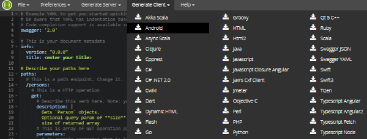
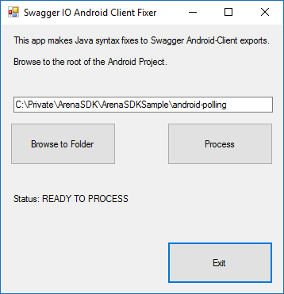

# Description

This Windows.Form project makes JAVA syntax fixes to the Android export from the [Swagger Editor](http://editor.swagger.io/).

Automates JAVA syntax fixes for the following issues:

* [Ambiguous Object](https://github.com/swagger-api/swagger-codegen/issues/4279)

* [Generating Enum Values](https://github.com/swagger-api/swagger-codegen/issues/4278)

